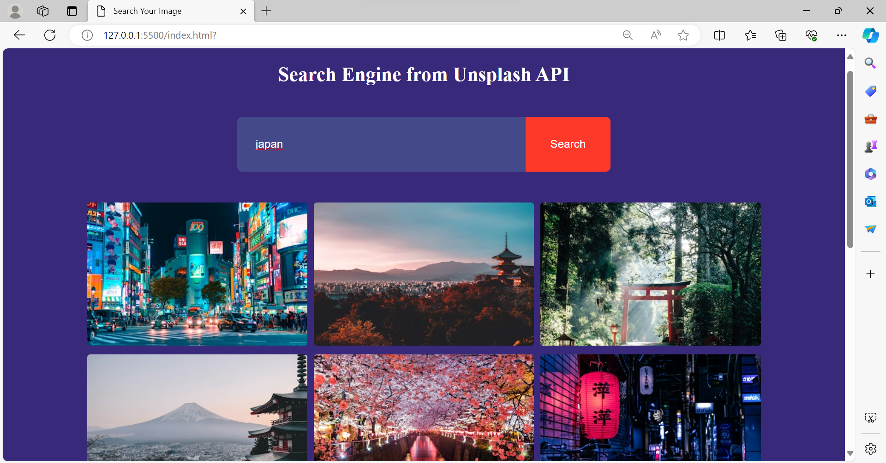

# Unsplash Image Search

This repository contains code for searching images using the Unsplash API.

## Getting Started

To get started with this project, follow these steps:

## Use your Unsplash API Key

## Getting the Unsplash API Access Key

To use the Unsplash API in this project, you will need to obtain an access key from the Unsplash website. Follow these steps to get your API access key:

- Create an Unsplash Developer Account:
- If you don't have an Unsplash account yet, you'll need to create one. Visit the Unsplash Developer website and sign up for a developer account.

### Create a New Application:

- After logging in to your Unsplash Developer account, navigate to the "Your Applications" section and create a new application. Provide the necessary details about your application.
- Obtain Your Access Key:
- Once your application is created, you will be provided with an access key. This key is required to authenticate your requests to the Unsplash API.

### Replace the Placeholder Key:

- Open the script.js file in this project and replace the placeholder/variable 'accesKey' with your actual Unsplash API access key.
- Save the changes to script.js and you're ready to use the Unsplash API in this project.
- For more detailed instructions on obtaining an API access key from Unsplash, refer to the Unsplash API Documentation.

## How it Works

This project utilizes the Unsplash API to search for images based on user input. The user can enter a keyword in the search box, and the application will fetch relevant images from the Unsplash API and display them on the page. Users can also click the "Show More" button to load more images.

## Technologies Used

HTML
CSS
JavaScript
API Reference, this project uses the Unsplash API to fetch images.

## image

